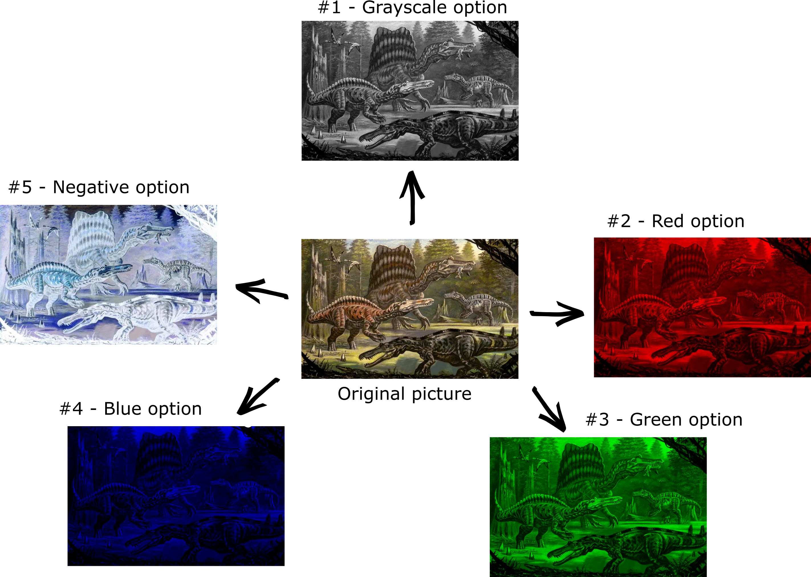

# ColorChanger
A simple C# console application that converts an image into grayscale, red, green, blue and negative mode. It was built to understand how RGBA color model works.

## How can I run it?
Just clone or download the code and run it using Visual Studio. Or just download the executable here.

## How can I use it?
Just follow the steps below and be happy :)

1)

2)

3)

4)

5)

### ...and you will got something like this:

